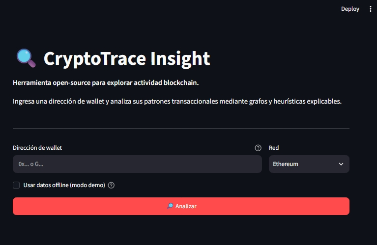
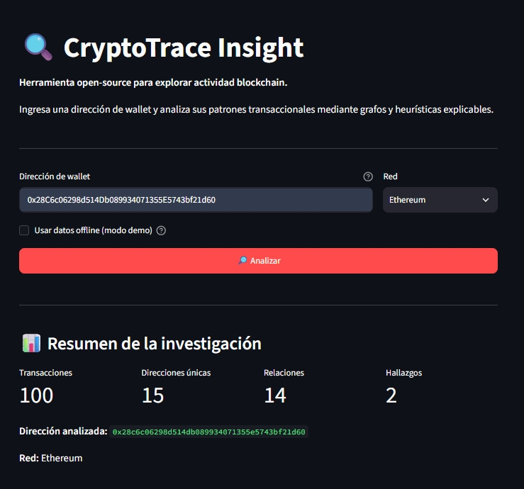
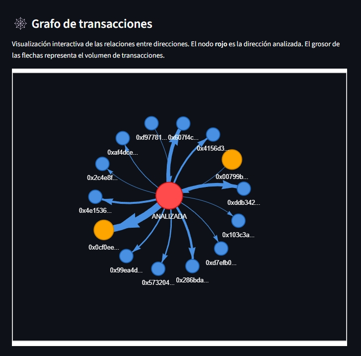
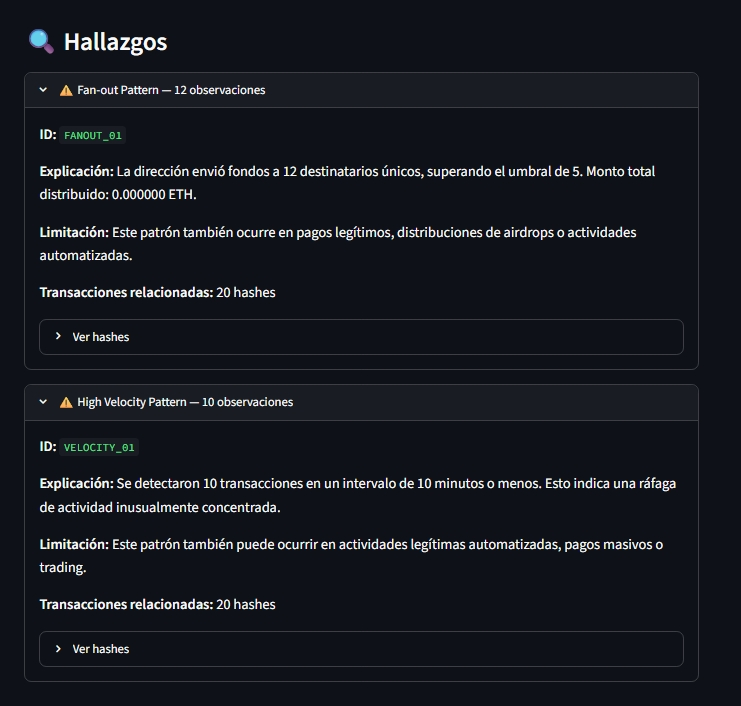
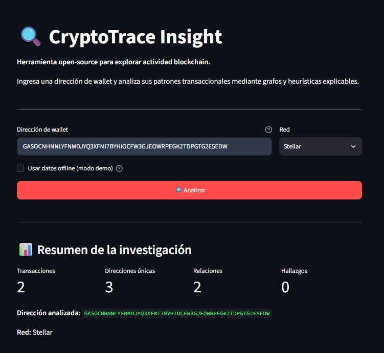
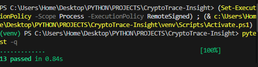
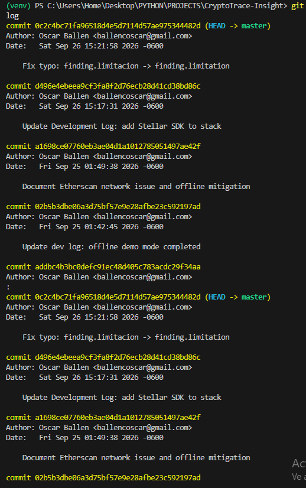

# 🔍 CryptoTrace Insight

> Herramienta open-source en Python para explorar actividad blockchain mediante grafos de transacciones y heurísticas explicables.

[](https://www.python.org/)
[](https://opensource.org/licenses/MIT)

---

## 🎯 ¿Qué es CryptoTrace Insight?

CryptoTrace Insight es una herramienta de exploración y análisis de actividad blockchain. Permite investigar una dirección de wallet para visualizar el flujo de fondos, detectar patrones observables y entender por qué fueron marcados.

**No es** una wallet, no custodia fondos, no calcula impuestos y no determina criminalidad. Es una herramienta de **exploración transparente y educativa**.

## 📸 Capturas

### 🖥️ Interfaz principal


### 📊 Análisis de Ethereum


### 🕸️ Grafo interactivo de transacciones


### 🔍 Hallazgos explicados


### ⭐ Análisis de Stellar


### 🧪 Tests unitarios pasando


### 📜 Historial de desarrollo

---

## ✨ Features

- 🔎 Análisis de direcciones Ethereum en tiempo real (Etherscan API V2)
- 🕸️ Visualización interactiva de grafos de transacciones (PyVis)
- 🧠 3 heurísticas explicables:
  - **Fan-out**: direcciones que envían a muchos destinatarios únicos
  - **High Velocity**: ráfagas de transacciones en poco tiempo
  - **Similar Amounts**: montos repetidos (structuring)
- 📊 Reportes estructurados con explicación y limitación por hallazgo
- 🎨 Interfaz web con Streamlit
- 🧪 13 tests unitarios pasando

---

## 🛠️ Stack tecnológico

- **Python 3.10+**
- **Streamlit** — Interfaz web
- **Requests** — Consumo de APIs
- **NetworkX** — Análisis de grafos
- **PyVis** — Visualización interactiva
- **Etherscan API V2** — Datos de Ethereum
- **pytest** — Testing

---

## 📦 Instalación

```bash
git clone https://github.com/OballenEC/cryptotrace-insight.git
cd cryptotrace-insight
python -m venv venv
venv\Scripts\activate  # Windows
source venv/bin/activate  # Mac/Linux
pip install -r requirements.txt
cp .env.example .env
# Editar .env y añadir tu ETHERSCAN_API_KEY